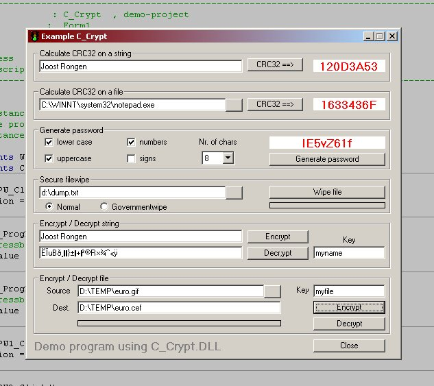



## CRC\_32, String\-encryption/\-decryption, File\-encryption/decryption, Passwords, Filewiping

### Description

This demo-project shows you how to use my C_Crypt.dll, whitch offers:

1. VERY FAST CRC-calculation on strings and files;

2. VERY STRONG encryption/decryption for strings and files;

3. Secure filewiping

(Normal = overwrite every byte with &H00 then kill the file)

(Governmentwipe = overwrite every byte with &HFF, next run with &H00 and third run at random. Then kill the file)

4. Flexible password generation

In case of an unexpected error, the component writes a detailed logfile, C_Crypt.log.

You can download my ActiveX Dll from ftp://ftp.confite.nl/pub/

and you are free to use it in your projects.

(Source-code available)
 
### More Info
 
See screenshot

download C_Crypt.zip (133 KB) from ftp://ftp.confite.nl/pub/

Register it to your system and make sure the demo-project has set a reference to it. (see reference.jpg)

             |
---                |---
**Submitted On**   |2001-12-02 13:31:00
**By**             |[Joost Rongen](https://github.com/Planet-Source-Code/PSCIndex/blob/master/ByAuthor/joost-rongen.md)
**Level**          |Intermediate
**User Rating**    |5.0 (20 globes from 4 users)
**Compatibility**  |VB 6\.0
**Category**       |[Miscellaneous](https://github.com/Planet-Source-Code/PSCIndex/blob/master/ByCategory/miscellaneous__1-1.md)
**World**          |[Visual Basic](https://github.com/Planet-Source-Code/PSCIndex/blob/master/ByWorld/visual-basic.md)
**Archive File**   |[CRC\_32,\_St389421222001\.zip](https://github.com/Planet-Source-Code/joost-rongen-crc-32-string-encryption-decryption-file-encryption-decryption-passwords-file__1-29397/archive/master.zip)

